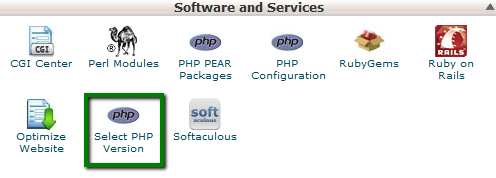
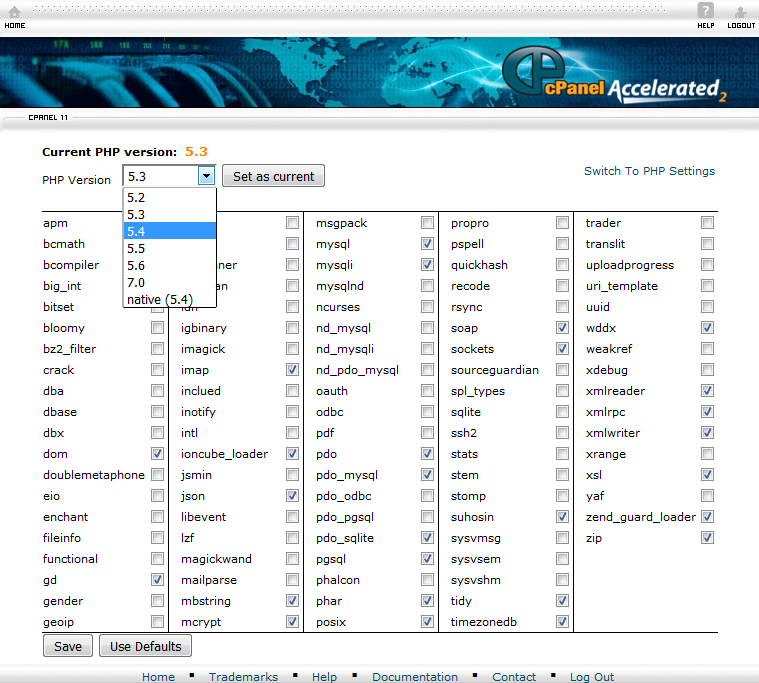

# Phalcon PHP on cPanel

Some hosts comes by default with Phalcon Frameworks or lets you enable optionally. A list of hosts that has Phalcon by default can be found [here](https://phalconphp.com/en/hosting).

Most cPanel shared hosts allows you to change php version, edit _php.ini_ and add extensions. This should enable you to add phalcon.so.

If none of these options are available, ask your hosting provider if is possible to enable Phalcon, otherwise your only option is to switch your hosting.

<br /><br />
### Installation on cPanel
1. Login to cPanel
2. If your PHP version is smaller than 5.6, go to **Software/Services** section of the cPanel home screen, click **Select PHP Version** (or similar).  

  
3. In the **PHP Version** list box, select the version that you want to use, and then click **Set as current**. Some hosts also let you choose the desired extensions; if Phalcon is one of them, then enable it.  

  
4. Copy the compatible phalcon.so in your cPanel account on a path outside public_html
5. Add **phalcon.so** to **php.ini**:
```
extension=/path/to/phalcon.so
```

<br /><br />
### Manual installation on cPanel
If the above steps are not available, you could try a manual approach. These steps are basically what cPanel is doing automatically.

1. Login to cPanel
2. If the PHP version is smaller than 5.6 add the following to **.htaccess**:
```
AddType application/x-httpd-php70 .php
```
3. Copy the compatible phalcon.so in your cPanel account on a path outside public_html
4. Add **phalcon.so** to **php.ini**:
```
extension=/path/to/phalcon.so
```
   4.1 If **php.ini** does not take effect, you can try adding it inside public directory of the project. In this case you might want to restrict the access from the web in **.htaccess**:
```
<IfModule mod_suphp.c>
    <Files php.ini>
        order allow,deny
        deny from all
    </Files>
</IfModule>
```
5. You can check your configuration anytime by creating a **phpinfo.php** file with the following:
```
<?php echo phpinfo();
```
